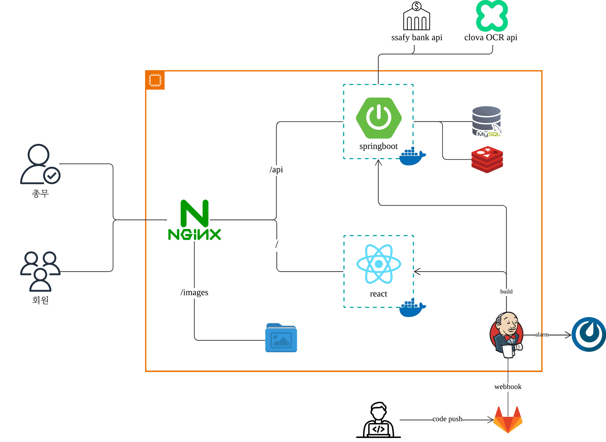

# 📒 대장부 – 투명한 공금 관리 서비스

> 회비 관리, 이제는 자동으로, 모두가 실시간으로 확인할 수 있게.

---

## 🗂️ 프로젝트 개요

- **프로젝트명**: 대장부 (Daejangboo)
- **목적**: 공금(회비)의 투명한 집행과 구성원의 실시간 열람을 위한 자동화 시스템 개발
- **개발 기간**: 2025.02.24 ~ 2025.04.11
- **기획 배경**: 분기별 보고서가 나오기 전까지는 지출 내역을 확인할 수 없는 기존의 불편함을 개선하고, 수기로 작성되던 회계보고를 자동화함으로써 **시간 절약**과 **신뢰도 향상**을 동시에 달성하고자 함

---

## 👥 팀 소개

| 이름 | 역할 |
|------|------|
| 김영진 | 백엔드 개발, 인프라, 테스트 및 배포 |
| 나혜원 | 프론트엔드 개발, UX/UI 기획, 서기 |
| 박다희 | 백엔드 개발, UX/UI 기획, 테스트 및 배포 |
| 박태현 | 프론트엔드 개발, UX/UI 기획 |
| 이가희 | 프론트엔드 개발, UX/UI 기획 |
| 이주은 | OCR 서버 개발, 백엔드 개발 |

---

## 📌 프로젝트 소개

> 대장부는 회비 집행의 투명성과 실용성을 동시에 확보하기 위한 서비스입니다.  
> 회계 담당자는 영수증만 등록하면 항목별로 자동 분류되어 내역이 구성되고,  
> 모든 구성원은 지출 정보를 실시간으로 확인할 수 있습니다.

- OCR을 통한 영수증 자동 인식 및 세부 항목 추출
- 관리자/일반 사용자 권한 분리
- 실시간 지출 내역 열람
- 분기별 자동 보고서 생성

---

## 🛠️ 기술 스택

| 분야 | 기술 |
|------|------|
| Frontend | React, TypeScript, Vite |
| Backend | Spring Boot, Spring Security, JPA |
| OCR 서버 | Flask |
| Database | MySQL |
| Infra / DevOps | Nginx, Docker |
| Test | Artillery (초당 2000명, 1000건 요청 부하 테스트 통과) |

---

## 🖼️ 화면 구성

| 페이지 | 설명 |
|--------|------|
| 로그인/회원가입 | 관리자와 일반 회원 분리 |
| 거래 내역 | 필터 + 타임라인 기반 내역 열람 |
| 영수증 등록 | 이미지 업로드 → 항목 자동 추출 |
| 상세 보기 | 거래 상세 및 OCR 결과 수정 |
| 관리자 페이지 | 전체 거래 관리, 사용자 권한 관리 |

---

## 🎯 주요 기능

### ✅ 1. 영수증 등록 및 항목 자동 추출 (OCR)
- TrOCR + CRAFT를 활용한 문자 인식 및 위치 추출
- 항목명, 수량, 금액 자동 분리
- 항목 추가/수정 기능 포함

### ✅ 2. 거래 내역 열람
- 일반 사용자도 **실시간 열람 가능**
- 기간, 항목, 금액 기준 필터링
- 타임라인 형태의 시각화 제공

### ✅ 3. 분기별 보고서 자동 생성
- 관리자 전용 기능
- 등록된 모든 내역을 자동 집계
- 엑셀 또는 PDF 형태로 출력 가능

### ✅ 4. 권한 분리 및 사용자 인증
- Spring Security 기반 인증 시스템
- 관리자/일반 사용자 기능 분리
- OAuth 적용 준비 중

---

## 🧩 시스템 아키텍처

## 🔍 성능 검증

- Artillery 부하 테스트 기준
  - 초당 2000명 동시접속 / 1000건 등록 처리 성공
- OCR 서버 평균 응답 속도: 3.2초

## 📎 관련 링크
- 시연 영상 : [Youtube Link](https://youtu.be/RbSjS4kDB2M)
  
---

> 🔐 투명한 회비 관리, 모두가 신뢰할 수 있는 시스템으로  
> **대장부**와 함께하세요.
